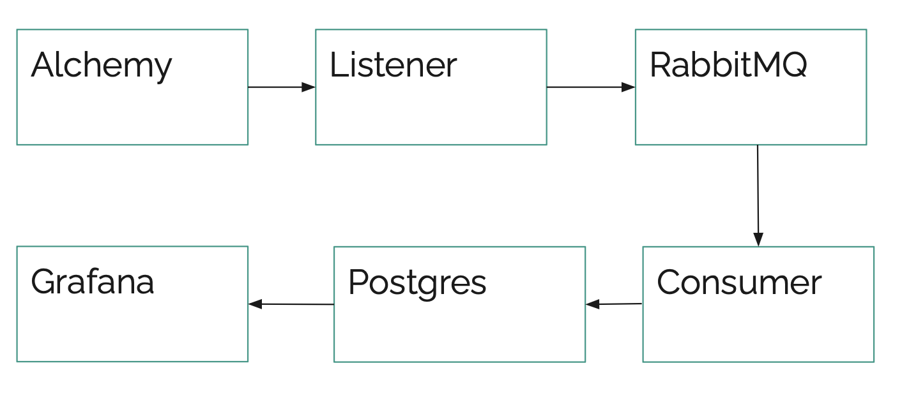

# Entry Point Data Pipeline

## Overview
This streaming data pipeline ingests User Operation events with Alchemy, processes them using RabbitMQ for message queuing, and store them in a PostgreSQL database. The pipeline is containerized using Docker and Grafana serves data visualisations. It works near real time. No previous or historical data is inserted.

## Modules

- **Listener**: Receives User Operations events from  Alchemy and processes them with RabbitMQ.
- **Consumer**: Writes the received events from RabbitMQ into a PostgreSQL database and loads the Bundlers list.
- **Dashboard**: Displays a chart in Grafana for User Operation events from the Entry Point contract identifying Biconomy bundlers.

## Pipeline Diagram


## Setup

1. Clone the repository
```
git clone https://github.com/cr4n/entry_point.git
cd entry_point
```

2. Set up the environment variables in an `.env` file following `env.sample` guidelines:
   - `ALCHEMY_URL`: Alchemy URL for querying blockchain data
   - `ENTRY_POINT_ADDRESS`: Ethereum address to pull events from
   - Leave the rest as it comes

3. Build and start the services:
```
docker-compose up --build
```

4. Open Grafana in a Web browser - (user:admin/password:admin):
```
https://localhost:3000
```
and update the password in the connector to `postgres` **(REQUIRED)**

## DB Data Dump  
- Query the DB:
```
docker exec -it postgres psql -U postgres -d BICO -c "select * from pipeline.raw_user_operations;"
```
- Make a DB dump:
```
docker exec -it postgres pg_dump -U postgres -d BICO -F c -f /tmp/entry_point_db.dump
docker cp postgres:/tmp/entry_point_db.dump ./entry_point_db.dump
```
- Make a CSV dump:
```
docker exec -it postgres psql -U postgres -d BICO -c "\COPY (SELECT * FROM pipeline.raw_user_operation) TO '/tmp/raw_user_operation.csv' CSV HEADER;"
docker cp postgres:/tmp/raw_user_operation.csv ./raw_user_operation.csv
```

**Notes**
- Ensure Docker and Docker Compose are installed on your system.
- The Grafana instance is configured to auto-generate an API key and set up dashboards. If you encounter any issues, refer to the service logs for troubleshooting.
- The Grafana instance requires a one time password update in UI on the Data Connector (setup - step 4)
