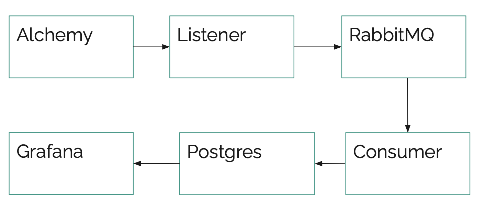

# Entry Point Data Pipeline

## Overview
This streaming data pipeline ingests EntryPoint `UserOperationEvent` logs with Alchemy, decodes the surrounding `handleOps` transaction, processes the enriched payload with RabbitMQ, and stores it in PostgreSQL. The pipeline is containerized using Docker and Grafana serves data visualisations. It works near real time. No previous or historical data is inserted.

## Modules

- **Listener**: Receives EntryPoint events from Alchemy, decodes the matching `handleOps` calldata, and publishes enriched UserOperation payloads to RabbitMQ.
- **Consumer**: Writes the received events from RabbitMQ into a PostgreSQL database and loads the Bundlers list.
- **Dashboard**: Displays bundler activity, sponsorship mix, and prefund versus actual gas cost in Grafana.

## Pipeline Diagram


## Setup

1. Clone the repository
```
git clone https://github.com/cr4n/entry_point.git
cd entry_point
```

2. Set up the environment variables in an `.env` file following `env.sample` guidelines:
   - `ALCHEMY_URL`: Alchemy URL for querying blockchain data
   - `ENTRY_POINT_ADDRESS`: Ethereum address to pull events from
   - Leave the rest as it comes

The stored payload now includes the emitted event fields plus decoded `handleOps` metadata such as bundler, beneficiary, bundle position, gas limits, EIP-1559 fee fields, computed `userOpHash`, and estimated `requiredPrefund`.

3. Build and start the services:
```
docker-compose up --build
```

4. Open Grafana in a Web browser - (user:admin/password:admin):
```
http://localhost:3000
```
and update the password in the connector to `postgres` **(REQUIRED)**

## DB Data Dump  
- Query the DB:
```
docker exec -it postgres psql -U postgres -d BICO -c "select * from pipeline.raw_user_operations;"
```
- Make a DB dump:
```
docker exec -it postgres pg_dump -U postgres -d BICO -F c -f /tmp/entry_point_db.dump
docker cp postgres:/tmp/entry_point_db.dump ./entry_point_db.dump
```
- Make a CSV dump:
```
docker exec -it postgres psql -U postgres -d BICO -c "\COPY (SELECT * FROM pipeline.raw_user_operations) TO '/tmp/raw_user_operations.csv' CSV HEADER;"
docker cp postgres:/tmp/raw_user_operations.csv ./raw_user_operations.csv
```

**Notes**
- Ensure Docker and Docker Compose are installed on your system.
- The Grafana instance is configured to auto-generate an API key and set up dashboards. If you encounter any issues, refer to the service logs for troubleshooting.
- The Grafana instance requires a one time password update in UI on the Data Connector (setup - step 4)
